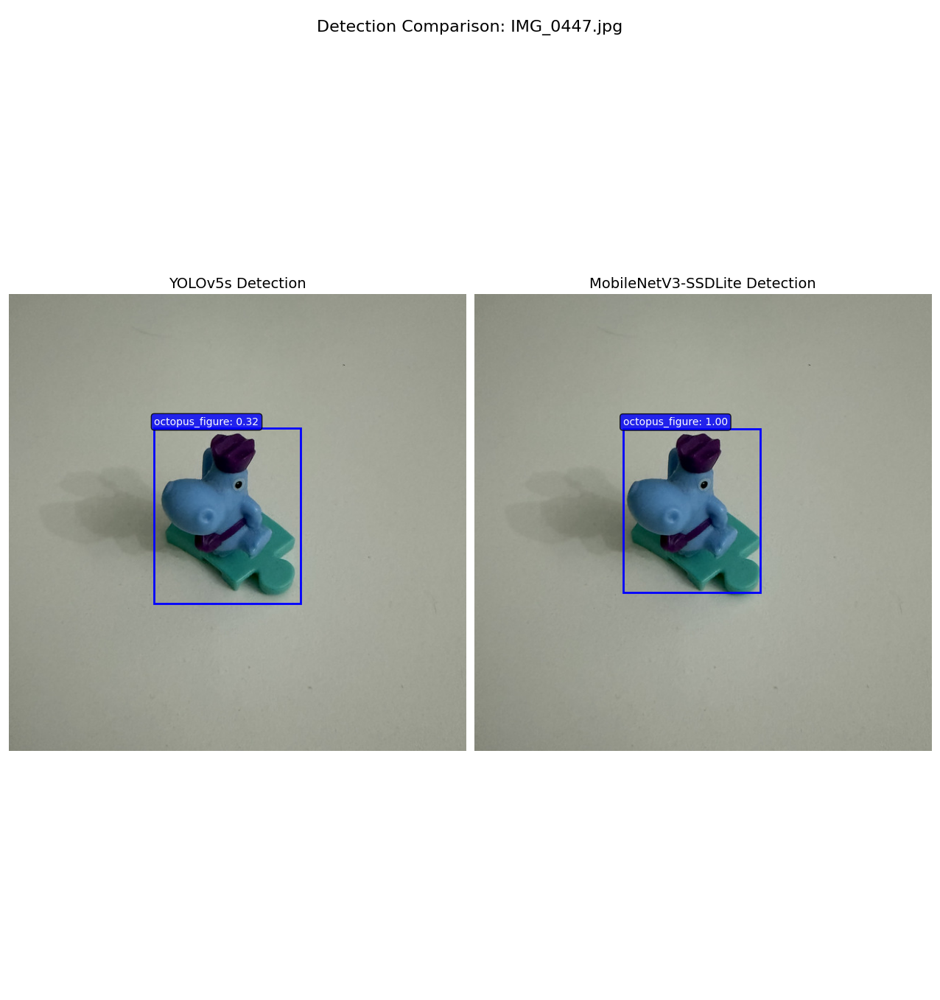
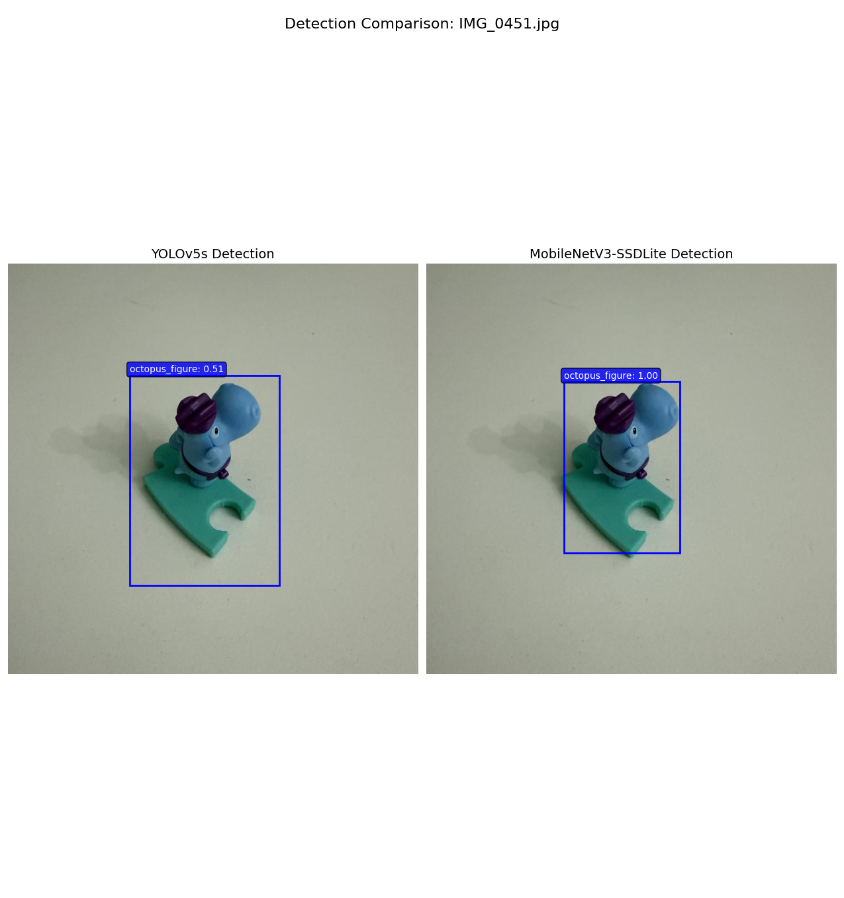
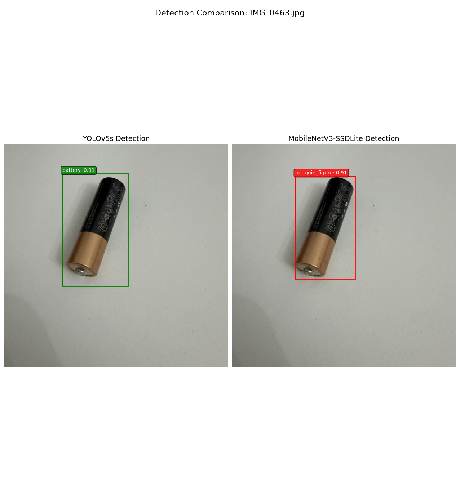
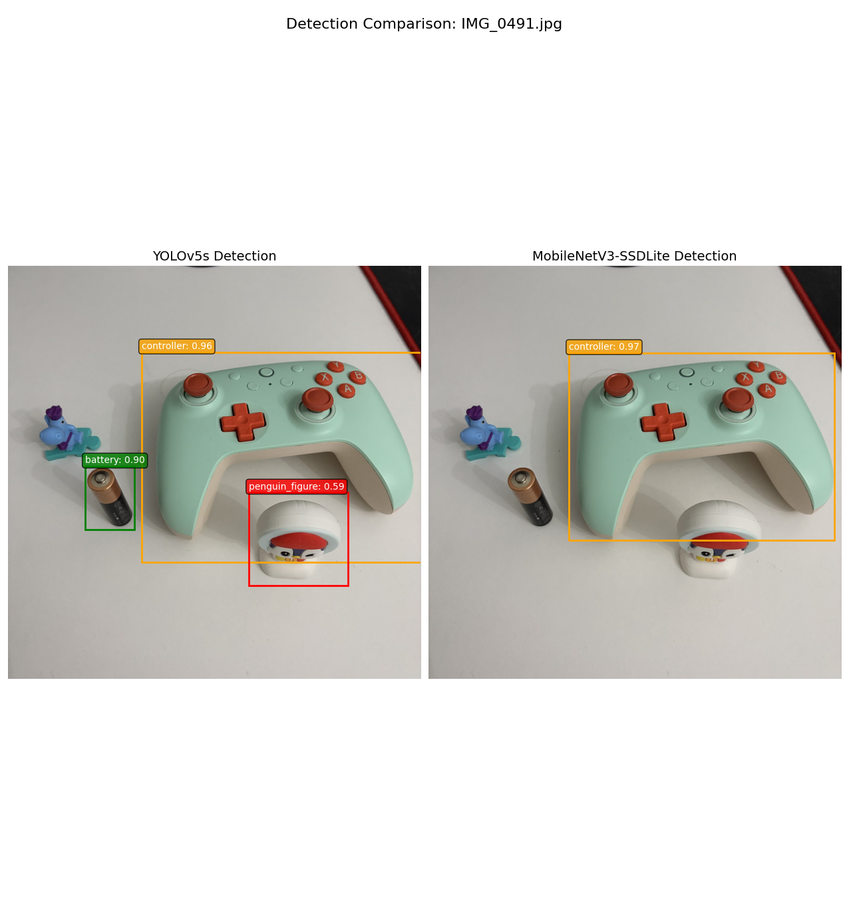

# Object Detection Project: Custom Object Detection with Transfer Learning

**Course:** Advanced Machine Learning  
**Assignment:** 3 - Object Detection  
**Date:** February 2026

---

## Table of Contents

1. [Dataset Description](#1-dataset-description)
2. [Theoretical Background](#2-theoretical-background)
   - 2.1 [Neural Networks for Object Recognition](#21-neural-networks-for-object-recognition)
   - 2.2 [Validation and Cross-Validation](#22-validation-and-cross-validation)
   - 2.3 [Overview of 8 Neural Network Architectures](#23-overview-of-8-neural-network-architectures)
3. [Implementation](#3-implementation)
4. [Experimental Results and Metric Comparison](#4-experimental-results-and-metric-comparison)

---

## 1. Dataset Description

### Overview

This project uses a custom dataset created specifically for object detection training. The dataset contains images of small objects photographed in various conditions to simulate real-world detection scenarios.

### Dataset Statistics

| Parameter | Value |
|-----------|-------|
| Total Images | 58 |
| Training Images | 48 |
| Validation Images | 10 |
| Number of Classes | 4 |
| Image Resolution | 640×640 pixels |
| Image Format | JPEG |
| Annotation Format | YOLO (normalized x_center, y_center, width, height) |

### Class Distribution

| Class ID | Class Name | Training Instances | Total Instances |
|----------|------------|-------------------|-----------------|
| 0 | penguin_figure | ~14 | 18 |
| 1 | octopus_figure (hippo) | ~15 | 19 |
| 2 | battery | ~10 | 13 |
| 3 | controller | ~15 | 19 |
| **Total** | | **~54** | **69** |

### Object Classes

1. **Penguin Figure** - A white Kinder Surprise-style toy figure with a red cap and distinctive mushroom-like appearance
2. **Octopus Figure (Hippo)** - A blue character figure sitting on a puzzle piece base
3. **Battery** - A standard AA battery used as a common household object for detection
4. **Controller** - A mint green game controller with orange buttons

### Data Collection Process

1. **Photography**: Images were captured using an iPhone camera with macro capability
2. **Image Preprocessing**: Original HEIF images (3024×3024) were converted to JPEG and resized to 640×640
3. **Annotation**: Bounding box annotations were created using [MakeSense.ai](https://www.makesense.ai/) in YOLO format
4. **Dataset Split**: 70/30 split for training/validation

### Dataset Structure

```
dataset/
├── images/
│   ├── train/     # 48 training images
│   └── val/       # 10 validation images
├── labels/
│   ├── train/     # 46 label files (2 background images)
│   └── val/       # 11 label files
└── data.yaml      # Dataset configuration
```

### Dataset Link

This is a custom dataset created for this assignment. The dataset is available in the `./dataset/` directory of this project repository.

---

## 2. Theoretical Background

### 2.1 Neural Networks for Object Recognition

Object detection is a fundamental computer vision task that involves both **localization** (finding where objects are) and **classification** (identifying what they are). Modern object detection systems use deep neural networks, particularly Convolutional Neural Networks (CNNs), to automatically learn hierarchical feature representations from images.

#### Convolutional Neural Networks (CNNs)

CNNs are the backbone of modern object detection systems. They consist of several key components:

1. **Convolutional Layers**: Apply learnable filters to extract spatial features like edges, textures, and shapes. Each filter produces a feature map that highlights specific patterns.

2. **Pooling Layers**: Reduce spatial dimensions while retaining important features, providing translation invariance and reducing computational load.

3. **Activation Functions**: Non-linear functions (typically ReLU) that enable the network to learn complex patterns.

4. **Fully Connected Layers**: Combine features for final classification decisions.

#### Object Detection Approaches

Object detection methods are broadly categorized into two approaches:

**Two-Stage Detectors** (e.g., Faster R-CNN):
- First stage: Generate region proposals (potential object locations)
- Second stage: Classify and refine each proposal
- Higher accuracy but slower inference

**Single-Stage Detectors** (e.g., YOLO, SSD):
- Directly predict bounding boxes and class probabilities in one pass
- Faster inference, suitable for real-time applications
- Recent versions achieve comparable accuracy to two-stage methods

#### Transfer Learning

Transfer learning leverages knowledge from pre-trained models (typically trained on large datasets like ImageNet or COCO) to improve performance on new, smaller datasets. Benefits include:

- **Faster convergence**: Pre-trained weights provide a good starting point
- **Better generalization**: Features learned from millions of images transfer well
- **Reduced data requirements**: Effective even with limited training data

### 2.2 Validation and Cross-Validation

#### Importance of Validation

Validation is crucial for:
- Evaluating model performance on unseen data
- Preventing overfitting to training data
- Hyperparameter tuning and model selection
- Estimating real-world performance

#### Holdout Validation

The simplest approach, used in this project:
- Split data into training (70%) and validation (30%) sets
- Train on training set, evaluate on validation set
- Advantages: Simple, fast, computationally efficient
- Disadvantages: May have high variance with small datasets

#### K-Fold Cross-Validation

A more robust approach for small datasets:
- Split data into K equal folds
- Train K models, each using K-1 folds for training and 1 for validation
- Average results across all folds
- Provides more reliable performance estimates

#### Object Detection Metrics

| Metric | Description |
|--------|-------------|
| **Precision** | TP / (TP + FP) - How many detections are correct |
| **Recall** | TP / (TP + FN) - How many objects are detected |
| **F1-Score** | Harmonic mean of Precision and Recall |
| **IoU** | Intersection over Union - Measures bounding box overlap |
| **mAP@0.5** | Mean Average Precision at IoU threshold 0.5 |
| **mAP@0.5:0.95** | Mean AP averaged over IoU thresholds 0.5 to 0.95 |

### 2.3 Overview of 8 Neural Network Architectures

#### 1. LeNet-5 (1998)

| Aspect | Details |
|--------|---------|
| **Type** | CNN |
| **Key Features** | Basic early CNN with few layers (7 layers) |
| **Architecture** | 2 Conv layers, 2 Pooling layers, 3 FC layers |
| **Application** | Handwritten digit recognition (MNIST) |
| **Parameters** | ~60,000 |
| **Significance** | Pioneered modern CNN architecture |

#### 2. AlexNet (2012)

| Aspect | Details |
|--------|---------|
| **Type** | CNN |
| **Key Features** | Deep network using ReLU and Dropout |
| **Architecture** | 5 Conv layers, 3 FC layers, ~60M parameters |
| **Application** | Image classification (ImageNet) |
| **Innovation** | First to use ReLU, GPU training, Dropout |
| **Significance** | Won ImageNet 2012, sparked deep learning revolution |

#### 3. VGG16/VGG19 (2014)

| Aspect | Details |
|--------|---------|
| **Type** | CNN |
| **Key Features** | Uniform 3×3 filters, deep architecture |
| **Architecture** | 16/19 layers, all using 3×3 convolutions |
| **Application** | High accuracy image classification |
| **Parameters** | ~138M (VGG16) |
| **Trade-off** | Excellent accuracy but high computational cost |

#### 4. GoogLeNet/Inception (2014)

| Aspect | Details |
|--------|---------|
| **Type** | CNN |
| **Key Features** | Parallel convolutions with different kernel sizes |
| **Architecture** | Inception modules with 1×1, 3×3, 5×5 convolutions |
| **Application** | Balanced accuracy and efficiency |
| **Parameters** | ~7M (much fewer than VGG) |
| **Innovation** | Inception module for multi-scale feature extraction |

#### 5. ResNet50/ResNet101 (2015)

| Aspect | Details |
|--------|---------|
| **Type** | CNN |
| **Key Features** | Residual (skip) connections |
| **Architecture** | 50/101 layers with identity shortcuts |
| **Application** | Very deep networks without gradient vanishing |
| **Innovation** | Skip connections enable training of 100+ layer networks |
| **Significance** | Won ImageNet 2015, fundamental architecture |

#### 6. MobileNetV2 (2018)

| Aspect | Details |
|--------|---------|
| **Type** | CNN |
| **Key Features** | Lightweight architecture for mobile devices |
| **Architecture** | Depthwise separable convolutions, inverted residuals |
| **Application** | Real-time recognition on edge devices |
| **Parameters** | ~3.4M |
| **Efficiency** | 10× fewer operations than VGG while maintaining accuracy |

#### 7. YOLOv5 (2020)

| Aspect | Details |
|--------|---------|
| **Type** | Object Detection CNN |
| **Key Features** | Single-shot detection and classification |
| **Architecture** | CSP backbone, PANet neck, detection head |
| **Application** | Fast real-time object detection |
| **Speed** | Up to 140 FPS on modern GPUs |
| **Variants** | YOLOv5n/s/m/l/x for different speed-accuracy trade-offs |

#### 8. Faster R-CNN (2015)

| Aspect | Details |
|--------|---------|
| **Type** | Object Detection CNN |
| **Key Features** | Two-stage model (Region Proposal + Classification) |
| **Architecture** | RPN for proposals, RoI pooling, classification head |
| **Application** | High detection accuracy |
| **Trade-off** | Higher accuracy than single-stage but slower |
| **Innovation** | Region Proposal Network (RPN) |

#### Architecture Comparison Summary

| Architecture | Year | Parameters | Speed | Accuracy | Best For |
|--------------|------|------------|-------|----------|----------|
| LeNet-5 | 1998 | 60K | Fast | Low | Simple tasks |
| AlexNet | 2012 | 60M | Medium | Medium | Classification |
| VGG16 | 2014 | 138M | Slow | High | Feature extraction |
| GoogLeNet | 2014 | 7M | Fast | High | Efficient classification |
| ResNet50 | 2015 | 25M | Medium | Very High | General purpose |
| MobileNetV2 | 2018 | 3.4M | Very Fast | Good | Mobile/Edge devices |
| YOLOv5 | 2020 | 7-87M | Very Fast | High | Real-time detection |
| Faster R-CNN | 2015 | ~40M | Slow | Very High | Accurate detection |

---

## 3. Implementation

### 3.1 Environment Setup

**Hardware:**
- GPU: NVIDIA GeForce RTX 4060 Laptop GPU (8GB VRAM)
- Framework: PyTorch 2.10.0 with CUDA 12.8

**Software Dependencies:**
```
torch==2.10.0
torchvision==0.25.0
ultralytics==8.4.11
albumentations==2.0.8
matplotlib==3.10.8
numpy==2.4.2
pillow==12.1.0
```

### 3.2 Model 1: YOLOv5s with Transfer Learning

#### Architecture

YOLOv5s (small variant) was chosen for its balance of speed and accuracy:

| Component | Details |
|-----------|---------|
| Backbone | CSPDarknet53 |
| Neck | PANet (Path Aggregation Network) |
| Head | YOLO detection head |
| Layers | 154 |
| Parameters | 9,123,740 |
| GFLOPs | 24.0 |

#### Transfer Learning Configuration

```python
# Pre-trained weights from COCO dataset (80 classes)
# 421/427 layers transferred, detection head adapted for 4 classes
model = YOLO("yolov5su.pt")
```

#### Training Configuration

| Parameter | Value |
|-----------|-------|
| Image Size | 640×640 |
| Batch Size | 16 |
| Max Epochs | 100 |
| Optimizer | AdamW (auto-selected) |
| Learning Rate | 0.00125 |
| Early Stopping | Patience 20 epochs |

#### Data Augmentation

| Augmentation | Value | Effect |
|--------------|-------|--------|
| HSV-Hue | 0.015 | Color variation |
| HSV-Saturation | 0.7 | Saturation variation |
| HSV-Value | 0.4 | Brightness variation |
| Rotation | 15° | Rotation augmentation |
| Translation | 0.1 | Position shift |
| Scale | 0.5 | Zoom in/out |
| Horizontal Flip | 0.5 | Mirror images |
| Mosaic | 1.0 | Combine 4 images |
| Mixup | 0.1 | Blend images |

### 3.3 Model 2: MobileNetV3-SSDLite with Transfer Learning

#### Architecture

MobileNetV3-SSDLite combines efficient backbone with single-shot detection:

| Component | Details |
|-----------|---------|
| Backbone | MobileNetV3-Large |
| Detection Head | SSDLite (lightweight SSD) |
| Input Size | 320×320 |
| Classes | 5 (4 objects + background) |

#### Transfer Learning Configuration

```python
# Pre-trained on COCO, classification head replaced for custom classes
weights = SSDLite320_MobileNet_V3_Large_Weights.DEFAULT
model = ssdlite320_mobilenet_v3_large(weights=weights)
# Replace classification head for 5 classes
model.head.classification_head = SSDClassificationHead(
    in_channels=[672, 480, 512, 256, 256, 128],
    num_anchors=[6, 6, 6, 6, 6, 6],
    num_classes=5
)
```

#### Training Configuration

| Parameter | Value |
|-----------|-------|
| Image Size | 320×320 |
| Batch Size | 8 |
| Epochs | 50 |
| Optimizer | SGD (momentum=0.9) |
| Learning Rate | 0.005 → 0.000005 (step decay) |
| LR Schedule | StepLR (step=15, gamma=0.1) |

#### Data Augmentation (Albumentations)

```python
train_transform = A.Compose([
    A.Resize(320, 320),
    A.HorizontalFlip(p=0.5),
    A.RandomBrightnessContrast(p=0.3),
    A.HueSaturationValue(p=0.3),
    A.GaussNoise(p=0.2),
    A.Rotate(limit=15, p=0.3),
    A.Normalize(mean=[0.485, 0.456, 0.406], 
                std=[0.229, 0.224, 0.225]),
    ToTensorV2()
])
```

### 3.4 Training Process

#### YOLOv5s Training

- Training stopped early at epoch 25 (patience=20)
- Best model saved at epoch 5
- Total training time: ~18 seconds
- GPU memory usage: ~3.7 GB

#### MobileNetV3-SSDLite Training

- Full 50 epochs completed
- Best model saved at epoch 49
- Total training time: ~20 seconds
- Loss decreased from 9.13 to 1.34

---

## 4. Experimental Results and Metric Comparison

### 4.1 Training Curves

#### YOLOv5s Training Progress

| Epoch | Box Loss | Cls Loss | mAP@0.5 | mAP@0.5:0.95 |
|-------|----------|----------|---------|--------------|
| 1 | 1.971 | 4.737 | 0.116 | 0.095 |
| 5 (best) | 1.398 | 2.200 | **0.981** | **0.649** |
| 10 | 1.265 | 1.619 | 0.873 | 0.517 |
| 25 (final) | 1.057 | 1.000 | 0.861 | 0.547 |

#### MobileNetV3-SSDLite Training Progress

| Epoch | Loss | Learning Rate |
|-------|------|---------------|
| 1 | 9.13 | 0.005 |
| 10 | 2.42 | 0.005 |
| 30 | 1.34 | 0.00005 |
| 49 (best) | **1.34** | 0.000005 |

### 4.2 Validation Metrics Comparison

| Metric | YOLOv5s | MobileNet-SSD | Winner |
|--------|---------|---------------|--------|
| **Precision** | 0.792 | 0.889 | MobileNet |
| **Recall** | 0.930 | 0.421 | YOLOv5s |
| **F1-Score** | 0.856 | 0.571 | YOLOv5s |
| **mAP@0.5** | 0.981 | N/A | YOLOv5s |
| **mAP@0.5:0.95** | 0.649 | N/A | YOLOv5s |

### 4.3 Per-Class Performance (YOLOv5s)

| Class | Precision | Recall | mAP@0.5 | mAP@0.5:0.95 |
|-------|-----------|--------|---------|--------------|
| penguin_figure | 1.000 | 0.730 | 0.938 | 0.689 |
| octopus_figure | 1.000 | 0.997 | 0.995 | 0.692 |
| battery | 0.663 | 1.000 | 0.995 | 0.608 |
| controller | 0.503 | 1.000 | 0.995 | 0.607 |

### 4.4 Inference Speed Comparison

| Model | Inference Time | Throughput |
|-------|---------------|------------|
| YOLOv5s | 6.88 ms/image | 145 FPS |
| MobileNet-SSD | 4.77 ms/image | 210 FPS |

*Note: MobileNet-SSD uses smaller input (320×320) vs YOLOv5s (640×640)*

### 4.5 Model Size Comparison

| Model | Parameters | Model Size |
|-------|------------|------------|
| YOLOv5s | 9.1M | 18.5 MB |
| MobileNet-SSD | 4.2M | ~16 MB |

### 4.6 Qualitative Analysis - Detection Examples

#### Single Object Detection - Penguin Figure

**IMG_0436 (Penguin Figure):**
- YOLOv5s: Incorrectly classified as both controller AND penguin (dual detection)
- MobileNet-SSD: Correct single detection as penguin
- *Issue: YOLOv5s false positive on controller class*


**IMG_0440 (Penguin Figure):**
- YOLOv5s: Correct detection, confidence 0.42
- MobileNet-SSD: Correct detection, confidence 1.00
- Both models successfully detected the penguin figure


#### Single Object Detection - Octopus/Hippo Figure

**IMG_0447 (Hippo Figure):**
- Both models correctly identified the figure
- YOLOv5s showed higher confidence



**IMG_0451 (Hippo Figure):**
- Both models correctly identified the figure



#### Single Object Detection - Battery

**IMG_0460 (Battery):**
- YOLOv5s: Overlapping detection with octopus/hippo class
- MobileNet-SSD: Correct detection
- *Issue: Class confusion in YOLOv5s*


**IMG_0463 (Battery):**
- YOLOv5s: Correct detection
- MobileNet-SSD: Incorrectly classified as penguin
- *Issue: MobileNet misclassification*



#### Single Object Detection - Controller

**IMG_0475 (Controller):**
- YOLOv5s: Predicted 2 controllers for 1 object (double detection)
- MobileNet-SSD: Correct single detection
- *Issue: YOLOv5s Non-Maximum Suppression (NMS) threshold*


#### Multi-Object Detection

**IMG_0490 (All 4 objects):**
- YOLOv5s: Detected 3/4 objects (missed penguin), false positive on background
- MobileNet-SSD: Failed to detect any objects
- *Issue: MobileNet struggles with multiple small objects*


**IMG_0491 (All 4 objects):**
- YOLOv5s: Detected 3/4 objects (missed octopus/hippo)
- MobileNet-SSD: Only detected controller
- *Issue: Both models have difficulty with dense scenes*



**IMG_0492 (All 4 objects):**
- YOLOv5s: False positive on background as controller, double detection on controller
- MobileNet-SSD: Only detected controller
- *Issue: Background confusion in complex scenes*


### 4.7 Error Analysis Summary

| Error Type | YOLOv5s | MobileNet-SSD |
|------------|---------|---------------|
| False Positives | Moderate (background confusion) | Low |
| False Negatives | Low | High (misses many objects) |
| Misclassification | Occasional | Moderate |
| Double Detection | Present | Absent |

### 4.8 Key Findings

1. **YOLOv5s Strengths:**
   - Higher recall (93% vs 42%) - detects most objects
   - Better multi-object detection
   - More consistent across different scenarios
   - Excellent mAP scores (98.1% @0.5)

2. **YOLOv5s Weaknesses:**
   - Occasional false positives (background as controller)
   - Double detections on some objects
   - Lower precision than MobileNet

3. **MobileNet-SSD Strengths:**
   - Higher precision (89% vs 79%)
   - Fewer false positives
   - Faster inference (4.77ms vs 6.88ms)
   - Smaller model size

4. **MobileNet-SSD Weaknesses:**
   - Poor recall (42%) - misses many objects
   - Struggles with multi-object scenes
   - Often only detects the most prominent object

### 4.9 Conclusions

1. **Overall Winner: YOLOv5s**
   - Significantly better F1-score (0.856 vs 0.571)
   - Much higher recall, critical for detection tasks
   - Better generalization to complex scenes

2. **Dataset Limitations:**
   - Small dataset (58 images, 69 instances) limits model performance
   - Class imbalance may affect certain categories
   - More diverse training data would improve results

3. **Transfer Learning Effectiveness:**
   - Both models benefited significantly from pre-trained weights
   - YOLOv5s transferred better (421/427 layers from COCO)
   - Training converged quickly (~20 seconds each)

4. **Recommendations:**
   - Use YOLOv5s for production when recall is important
   - Consider MobileNet-SSD for edge devices where speed is critical
   - Increase dataset size for better generalization
   - Tune NMS threshold for YOLOv5s to reduce double detections

---

## Appendix: Detection Results Gallery

### Single Object Detections

| Image | Object | YOLOv5s | MobileNet-SSD |
|-------|--------|---------|---------------|
| 0436 | Penguin | ❌ (also controller) | ✅ |
| 0440 | Penguin | ✅ | ✅ |
| 0447 | Hippo | ✅ | ✅ |
| 0451 | Hippo | ✅ | ✅ |
| 0460 | Battery | ❌ (overlaps) | ✅ |
| 0463 | Battery | ✅ | ❌ (penguin) |
| 0475 | Controller | ❌ (double) | ✅ |

### Multi-Object Detections

| Image | Objects | YOLOv5s | MobileNet-SSD |
|-------|---------|---------|---------------|
| 0490 | All 4 | 3/4 + FP | 0/4 |
| 0491 | All 4 | 3/4 | 1/4 |
| 0492 | All 4 | 2/4 + FP | 1/4 |

---

## References

1. Redmon, J., & Farhadi, A. (2018). YOLOv3: An Incremental Improvement. arXiv:1804.02767
2. Howard, A., et al. (2019). Searching for MobileNetV3. arXiv:1905.02244
3. Liu, W., et al. (2016). SSD: Single Shot MultiBox Detector. ECCV 2016
4. He, K., et al. (2016). Deep Residual Learning for Image Recognition. CVPR 2016
5. Ultralytics YOLOv5 Documentation: https://docs.ultralytics.com/yolov5/
6. PyTorch Object Detection Tutorial: https://pytorch.org/tutorials/intermediate/torchvision_tutorial.html
